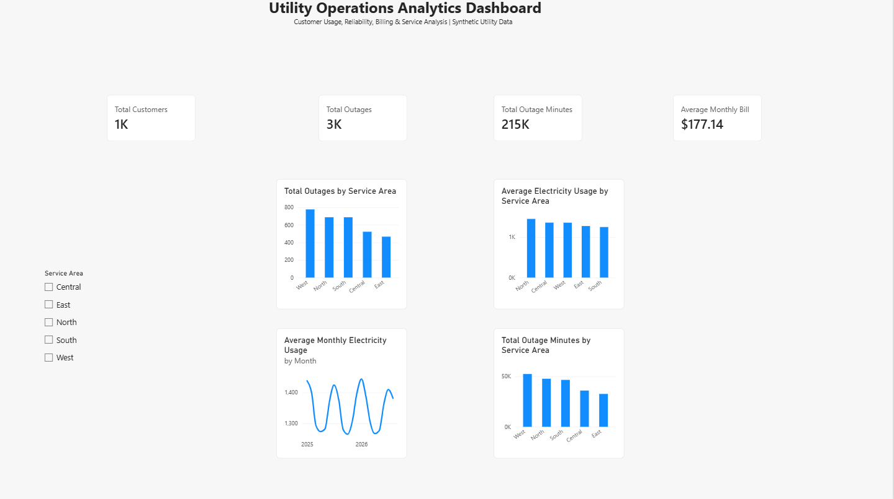

# Utility Operations Analytics

## Project Overview

This portfolio project demonstrates how Python, SQL, and Power BI can be used together to analyze utility operations data and identify actionable business insights.

The project uses a synthetic dataset representing customer electricity usage, billing activity, service calls, and outages across five service areas. The goal is to demonstrate an end-to-end analytics workflow similar to the types of operational and customer-data challenges that utility companies and utility technology providers may encounter.

The analysis focuses on electricity demand, service reliability, customer payment behavior, and differences between geographic service areas.

## Business Problem

Utility organizations collect large amounts of operational and customer data. Turning that data into useful information can help organizations identify service problems, understand demand patterns, and allocate resources more effectively.

This project addresses several business questions:

- Which service areas experience the most outages?
- Which service areas have the greatest outage duration?
- How does electricity usage vary between service areas?
- Does electricity demand show seasonal patterns?
- How does temperature relate to electricity usage?
- Which customers experience unusually high usage?
- Are service calls higher during months with outages?
- Which customers show repeated late-payment behavior?

## Tools Used

### Python / Jupyter Notebook
Python was used for exploratory data analysis, data-quality checks, descriptive statistics, trend analysis, correlation analysis, and identification of high-usage customers.

Key libraries:
- pandas
- matplotlib

### SQL / MySQL
SQL was used to store and query the 20,000-record dataset.

Analysis included:
- Aggregation
- GROUP BY
- CASE statements
- Customer-level analysis
- Service-area comparisons
- Outage analysis
- Payment behavior analysis

### Power BI
Power BI was used to create an interactive operations dashboard summarizing the most important findings.

## Dataset

The project uses a synthetic utility dataset containing **20,000 monthly customer records**.

The dataset includes:

- Customer ID
- Month
- Service Area
- Customer Type
- Meter Type
- Average Temperature
- Electricity Usage (kWh)
- Bill Amount
- Payment Days Late
- Outage Count
- Outage Minutes
- Service Calls
- Injected Usage Anomaly

Because the dataset is synthetic, the project does not contain confidential customer or utility-company information.

## Analysis Workflow

### 1. Python Exploratory Analysis
Python was used to:
- Load and inspect the dataset
- Check data types and missing values
- Generate descriptive statistics
- Analyze monthly electricity usage
- Examine outage patterns
- Compare temperature and electricity usage
- Identify high-usage customers

### 2. SQL Analysis
SQL queries were used to examine:
- Average electricity usage by service area
- Average customer bills by service area
- Total outages by service area
- Total outage minutes by service area
- Customers experiencing the greatest outage duration
- Service calls during outage versus non-outage months
- Customers with repeated late payments

### 3. Power BI Dashboard
The final dashboard includes:
- Total Customers
- Total Outages
- Total Outage Minutes
- Average Monthly Bill
- Total Outages by Service Area
- Average Electricity Usage by Service Area
- Average Monthly Electricity Usage
- Total Outage Minutes by Service Area
- Interactive Service Area filter

## Key Findings

- The **West** service area recorded the highest outage activity, with **776 outages** and **52,340 outage minutes**.
- The **North** service area had the highest average electricity consumption at approximately **1,454.8 kWh**.
- Average service calls were higher during months with outages than during months without outages.
- Monthly electricity usage demonstrated recurring seasonal patterns.
- SQL analysis identified customers with repeated late-payment behavior.

## Business Recommendations

1. Investigate service areas with consistently high outage frequency and duration.
2. Use seasonal electricity-usage patterns to support demand and capacity planning.
3. Prepare customer-service resources for periods of increased outage activity.
4. Monitor unusually high electricity usage for potential anomalies or operational issues.
5. Analyze repeated late-payment patterns to support proactive customer communication.
6. Combine operational, billing, and customer-service data for comprehensive performance monitoring.

## Project Files

| File | Description |
|---|---|
| `Midwest_Electric_Utility_Analytics.csv` | Synthetic utility dataset |
| `Utility_Operations_Analytics.ipynb` | Python exploratory data analysis |
| `Utility_Operations_Analytics.sql` | MySQL analysis queries |
| `Utility_Operations_Analytics_Dashboard.pbix` | Interactive Power BI dashboard |
| `dashboard_screenshot.png` | Preview of the completed dashboard |

## Skills Demonstrated

- Data Analytics
- Exploratory Data Analysis (EDA)
- Python
- pandas
- Data Visualization
- SQL / MySQL
- Power BI
- Data Cleaning
- Descriptive Statistics
- Business Analysis
- Dashboard Development
- Data Storytelling

## Dashboard Preview

## About This Project

This project was created as a portfolio demonstration of an end-to-end data analytics workflow. It combines programming, database querying, visualization, and business analysis to transform a raw synthetic dataset into actionable operational insights.
